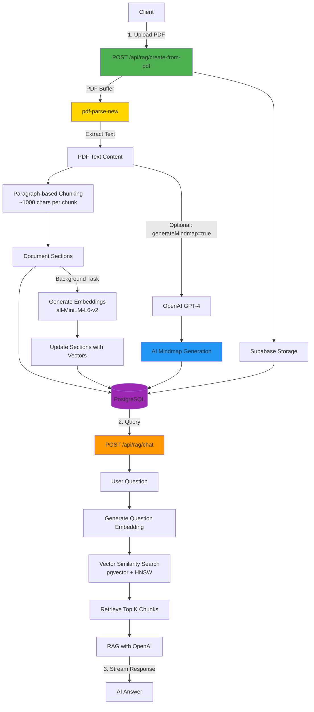

# Mindmap Backend - RAG System with AI Mindmap Generation

Production-ready backend for intelligent document analysis. Upload PDFs to automatically generate interactive mindmaps with AI-powered topic extraction and scoped Q&A capabilities.

## Overview



## Features

**AI-Powered Document Analysis**
- Automatic topic extraction and hierarchical organization
- Keyword identification for each concept
- Intelligent relationship mapping

**Scoped RAG System**
- Click any mindmap node → chat with that topic only
- Higher precision answers through context scoping
- Semantic chunk-to-node linking

**Production Ready**
- Supabase Storage for file persistence
- PostgreSQL + pgvector for vector search
- Row Level Security (RLS) and rate limiting
- TypeScript strict mode

## Quick Start

### Prerequisites

- Node.js 20+
- Supabase project with database and storage
- OpenAI API key

### Installation

**1. Install Node.js dependencies:**
```bash
npm install
```

**2. Configure environment:**
```bash
cp .env.example .env
# Edit .env with your credentials
```

### Environment Variables

```env
# Server
PORT=4000
NODE_ENV=production

# Supabase
SUPABASE_URL=https://your-project.supabase.co
SUPABASE_ANON_KEY=your-anon-key
SUPABASE_SERVICE_ROLE_KEY=your-service-key

# OpenAI
OPENAI_API_KEY=sk-your-key
OPENAI_MODEL=gpt-4-turbo-preview
OPENAI_EMBEDDING_MODEL=text-embedding-3-small

# RAG Configuration
# 2025 Best Practices: 512 tokens with 20% overlap (100 tokens)
CHUNK_SIZE=512
CHUNK_OVERLAP=100
TOP_K_CHUNKS=5
MIN_SECTION_SIZE=200
```

### Database Setup

Run migrations in Supabase SQL Editor (in order):
```bash
src/db/migrations/0001_rag.sql
src/db/migrations/0002_db.sql
```

Create storage bucket in Supabase Dashboard:
- Go to Storage → Create bucket
- Name: `documents`
- Public: false

### Run

```bash
# Development
npm run dev

# Production
npm run build
npm start
```

## API Endpoints

### Authentication

| Method | Endpoint             | Description       |
| ------ | -------------------- | ----------------- |
| POST   | `/api/auth/register` | Register new user |
| POST   | `/api/auth/login`    | Login user        |
| GET    | `/api/auth/me`       | Get current user  |

### RAG & Documents (Core Feature)

| Method | Endpoint                      | Description                                           |
| ------ | ----------------------------- | ----------------------------------------------------- |
| POST   | `/api/rag/create-from-pdf`    | **Upload PDF → Generate chunks + optional mindmap**   |
| POST   | `/api/rag/chat`               | **Chat with RAG context (streaming)**                 |
| GET    | `/api/rag/documents`          | List user documents                                   |
| GET    | `/api/rag/documents/:id`      | Get document with sections                            |
| DELETE | `/api/rag/documents/:id`      | Delete document                                       |

### Mindmaps

| Method | Endpoint            | Description                     |
| ------ | ------------------- | ------------------------------- |
| POST   | `/api/mindmaps`     | Create empty mindmap            |
| GET    | `/api/mindmaps`     | List user mindmaps              |
| GET    | `/api/mindmaps/:id` | Get mindmap with nodes          |
| PUT    | `/api/mindmaps/:id` | Update mindmap                  |
| DELETE | `/api/mindmaps/:id` | Delete mindmap                  |

### Conversations

| Method | Endpoint                 | Description                    |
| ------ | ------------------------ | ------------------------------ |
| GET    | `/api/conversations`     | List conversations             |
| GET    | `/api/conversations/:id` | Get conversation with messages |

## Development Workflow

### Starting the Application

```bash
# Development
npm run dev
```

### PDF Processing

✅ **Direct PDF processing** using pdf-parse-new in Node.js - no external services required
⚡ **Fast processing** - text extraction happens in the Node.js process
🔧 **Simple architecture** - single Node.js application handles everything
📦 **Background embeddings** - vector embeddings generated asynchronously after document creation

## Core Workflow

### 1. Upload PDF & Create Document (with Optional Mindmap)

**Request:**
```http
POST /api/rag/create-from-pdf
Authorization: Bearer {token}
Content-Type: multipart/form-data

file: document.pdf
title: "Optional custom title"
generateMindmap: true
```

**Response:**
```json
{
  "success": true,
  "data": {
    "id": "uuid",
    "name": "Building Efficient SLM",
    "storage_object_id": "uuid",
    "sections_created": 45,
    "created_at": "2024-01-01T00:00:00Z",
    "mindmap": {
      "id": "uuid",
      "title": "Building Efficient SLM",
      "mindmap_data": {
        "title": "Building Efficient SLM",
        "central_topic": "Efficient Language Models",
        "nodes": [
          {
            "id": "node-0",
            "label": "Efficient SLM Development",
            "keywords": ["efficiency", "optimization"],
            "level": 0,
            "parent_id": null
          }
        ],
        "edges": [
          {
            "from": "node-0",
            "to": "node-1",
            "relationship": "contains"
          }
        ]
      },
      "nodes_count": 8
    }
  }
}
```

### 2. Chat with RAG Context

**Request:**
```http
POST /api/rag/chat
Authorization: Bearer {token}
Content-Type: application/json

{
  "question": "What are the key components?",
  "document_id": "uuid",
  "match_threshold": 0.78,
  "match_count": 5
}
```

**Response (SSE):**
```
data: {"content": "Based on the section"}
data: {"content": ", the key components include..."}
data: [DONE]
```

## Mindmap JSON Structure

```typescript
interface MindmapData {
  title: string;
  central_topic: string;
  summary?: string;
  nodes: MindmapNode[];
  edges: MindmapEdge[];
}

interface MindmapNode {
  id: string;        // "node-0", "node-1", etc.
  label: string;     // Topic name
  keywords: string[]; // 3-7 relevant keywords
  level: number;     // 0 = center, 1+ = branches
  parent_id: string | null;
}

interface MindmapEdge {
  from: string;      // Source node ID
  to: string;        // Target node ID
  relationship?: string; // "contains", "describes", etc.
}
```

## Architecture

### Tech Stack

- **Runtime**: Node.js 20+ with TypeScript
- **Framework**: Express.js 5
- **Database**: Supabase (PostgreSQL + pgvector)
- **AI**: OpenAI GPT-4 for chat
- **Embeddings**: Local all-MiniLM-L6-v2 via Transformers.js
- **PDF Processing**: pdf-parse-new (in-process, Node.js)
- **Storage**: Supabase Storage
- **Security**: Helmet, CORS, RLS, Rate Limiting

### Project Structure

```
backend/
├── src/
│   ├── config/           # Environment & API configs
│   ├── db/migrations/    # SQL migrations (0001_rag.sql, 0002_db.sql)
│   ├── middlewares/      # Auth, validation, rate limiting
│   ├── modules/
│   │   ├── auth/         # Authentication
│   │   ├── mindmaps/     # Mindmap CRUD operations
│   │   ├── rag/          # PDF processing, RAG chat, documents
│   │   └── conversations/# Chat history
│   ├── services/         # LLM, Storage, Embedding
│   ├── utils/            # Helpers (errors, logger, response)
│   └── server.ts         # Entry point
└── tests/                # API tests
```

### How It Works

**Paragraph-Based Chunking:**
1. Split PDF text by paragraph breaks (double newlines)
2. Combine paragraphs into ~1000 character chunks
3. Store as document_sections with metadata
4. Generate embeddings asynchronously in background

**Vector Search:**
- Uses pgvector with HNSW index
- Index type: `vector_ip_ops` (inner product for normalized vectors)
- Parameters: `m=16, ef_construction=256`
- Search time: ~5ms for 10k+ chunks

## Deployment

### Build

```bash
npm run build
```

### Environment

Set `NODE_ENV=production` and configure CORS:
```env
CORS_ORIGIN=https://your-frontend.com
```

### Monitoring

- **Logs**: Pino structured JSON logging
- **Health**: `GET /health` endpoint
- **Errors**: Centralized error handler

## Troubleshooting

### PDF Processing Issues

**"Failed to load PDF" error:**
- Ensure PDF file is not corrupted
- Check file size limits (adjust multer config if needed)
- Verify sufficient disk space for temp files

**"Out of memory" during PDF processing:**
- Large PDFs may require more memory
- Consider increasing Node.js memory limit: `NODE_OPTIONS="--max-old-space-size=4096"`
- Process PDFs in smaller batches

### Database Issues

**"pgvector extension not found":**
- Ensure migrations are run in order (0001, 0002, 0003)
- Check Supabase dashboard → Database → Extensions
- Enable `vector` extension if not enabled

### General Issues

**Port conflicts:**
- Main backend: Change `PORT` in `.env` (default 4000)
- Python service: Change port in `python-service/.env` (default 5000)

**CORS errors:**
- Update `CORS_ORIGIN` in `.env` to match your frontend URL

## License

MIT

## Support

For issues or questions, create an issue in the repository.
