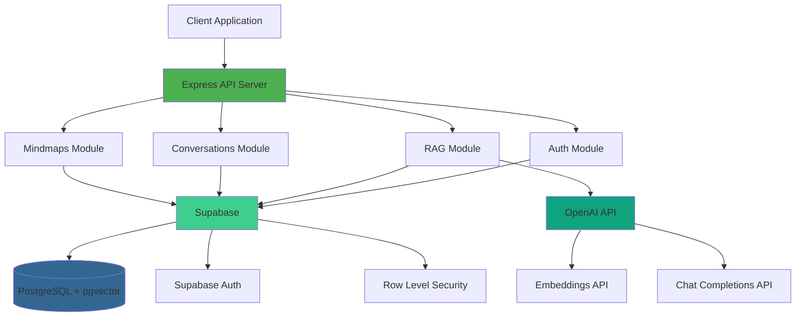

# Production-Ready RAG Backend with Supabase

A complete, minimal RAG (Retrieval-Augmented Generation) system built with TypeScript, Node.js, and Supabase as the sole database and vector store.

## Architecture



## Features

✅ **Full RAG Pipeline**
- Document ingestion (PDF, TXT)
- Intelligent text chunking with overlap
- OpenAI embeddings (text-embedding-3-small)
- Vector similarity search with pgvector (HNSW index)
- Context-aware LLM responses

✅ **Streaming Chat**
- Server-Sent Events (SSE) for real-time responses
- Conversation history management
- Retrieved context tracking

✅ **Complete API**
- Authentication (register, login, refresh)
- Mindmap CRUD operations
- Conversation management
- Health check endpoint

✅ **Production-Ready**
- Rate limiting (tiered by operation type)
- Input validation with Zod
- Error handling and logging
- Security headers (Helmet)
- CORS configuration
- TypeScript strict mode

## Quick Start

### Prerequisites

- Node.js 20+
- Supabase account
- OpenAI API key

### Installation

```bash
# Install dependencies
npm install

# Setup environment
cp .env.example .env
# Edit .env with your credentials
```

### Environment Variables

```env
# Server
PORT=5000
NODE_ENV=development

# Supabase (get from https://supabase.com/dashboard)
SUPABASE_URL=https://your-project.supabase.co
SUPABASE_ANON_KEY=your-anon-key
SUPABASE_SERVICE_ROLE_KEY=your-service-role-key

# OpenAI
OPENAI_API_KEY=sk-your-key
OPENAI_MODEL=gpt-4-turbo-preview
OPENAI_EMBEDDING_MODEL=text-embedding-3-small

# RAG Configuration
CHUNK_SIZE=1000
CHUNK_OVERLAP=200
TOP_K_CHUNKS=5

# Rate Limiting
RATE_LIMIT_WINDOW_MS=900000
RATE_LIMIT_MAX_REQUESTS=100
```

### Database Setup

1. Run migrations in your Supabase SQL Editor:

```bash
# Copy and execute in order:
src/db/migrations/0001_init.sql
src/db/migrations/0002_rls.sql
src/db/migrations/0003_ai.sql
```

2. Enable pgvector extension (if not already enabled):
```sql
create extension if not exists vector;
```

### Run Development Server

```bash
npm run dev
```

Server will start on `http://localhost:5000`

### Build for Production

```bash
npm run build
npm start
```

## API Endpoints

### Authentication

| Method | Endpoint | Description |
|--------|----------|-------------|
| POST | `/api/auth/register` | Register new user |
| POST | `/api/auth/login` | Login user |
| POST | `/api/auth/refresh` | Refresh access token |
| GET | `/api/auth/me` | Get current user |

### RAG

| Method | Endpoint | Description |
|--------|----------|-------------|
| POST | `/api/ingest` | Upload & process document (PDF/text) |
| POST | `/api/chat` | Chat with streaming (SSE) |
| POST | `/api/query` | Query without streaming |

### Conversations

| Method | Endpoint | Description |
|--------|----------|-------------|
| GET | `/api/conversations` | List user conversations |
| POST | `/api/conversations` | Create conversation |
| GET | `/api/conversations/:id` | Get conversation with messages |
| PUT | `/api/conversations/:id` | Update conversation |
| DELETE | `/api/conversations/:id` | Delete conversation |

### Mindmaps

| Method | Endpoint | Description |
|--------|----------|-------------|
| GET | `/api/mindmaps` | List user mindmaps |
| POST | `/api/mindmaps` | Create mindmap |
| GET | `/api/mindmaps/:id` | Get mindmap with nodes |
| PUT | `/api/mindmaps/:id` | Update mindmap |
| DELETE | `/api/mindmaps/:id` | Delete mindmap |

## Deployment

### Railway

```bash
# Install Railway CLI
npm i -g @railway/cli

# Login and deploy
railway login
railway init
railway up
```

Add environment variables in Railway dashboard.

### Vercel

```bash
# Install Vercel CLI
npm i -g vercel

# Deploy
vercel
```

Create `vercel.json`:
```json
{
  "version": 2,
  "builds": [
    {
      "src": "dist/server.js",
      "use": "@vercel/node"
    }
  ],
  "routes": [
    {
      "src": "/(.*)",
      "dest": "dist/server.js"
    }
  ]
}
```

### Render

1. Create new Web Service
2. Connect your repository
3. Build Command: `npm install && npm run build`
4. Start Command: `npm start`
5. Add environment variables in dashboard

### Docker

```dockerfile
FROM node:20-alpine
WORKDIR /app
COPY package*.json ./
RUN npm ci --only=production
COPY . .
RUN npm run build
EXPOSE 5000
CMD ["npm", "start"]
```

Build and run:
```bash
docker build -t rag-backend .
docker run -p 5000:5000 --env-file .env rag-backend
```

## Testing

Use the HTTP test file for manual testing:

```bash
# Open in VS Code with REST Client extension
tests/api-tests.http
```

Or use curl:

```bash
# Register
curl -X POST http://localhost:5000/api/auth/register \
  -H "Content-Type: application/json" \
  -d '{"email":"test@example.com","password":"SecurePass123!"}'

# Ingest document
curl -X POST http://localhost:5000/api/ingest \
  -H "Authorization: Bearer YOUR_TOKEN" \
  -H "Content-Type: application/json" \
  -d '{"text":"Your document content here"}'

# Chat (streaming)
curl -N -X POST http://localhost:5000/api/chat \
  -H "Authorization: Bearer YOUR_TOKEN" \
  -H "Content-Type: application/json" \
  -d '{"question":"What is in the document?","stream":true}'
```

## Project Structure

```
backend/
├── src/
│   ├── config/           # Configuration (env, supabase, openai)
│   ├── core/
│   │   └── middlewares/  # Auth, validation, rate limiting, errors
│   ├── db/
│   │   └── migrations/   # SQL migration files
│   ├── modules/
│   │   ├── auth/         # Authentication
│   │   ├── rag/          # RAG implementation
│   │   ├── conversations/# Chat history
│   │   └── mindmaps/     # Mindmap CRUD
│   ├── utils/            # Helpers (errors, logger, chunking)
│   ├── app.ts            # Express setup
│   └── server.ts         # Entry point
├── tests/                # API tests
└── docs/                 # Documentation
```

## Rate Limits

| Operation | Limit |
|-----------|-------|
| General API | 100 requests / 15 min |
| Authentication | 5 requests / 15 min |
| Document Ingest | 10 requests / hour |
| Chat/Query | 60 requests / hour |

## Technology Stack

- **Runtime**: Node.js 20+
- **Framework**: Express.js 5+
- **Language**: TypeScript (strict mode)
- **Database**: Supabase (PostgreSQL + pgvector)
- **Vector Search**: pgvector with HNSW index
- **AI**: OpenAI (GPT-4, text-embedding-3-small)
- **Validation**: Zod
- **Logging**: Pino
- **Security**: Helmet, CORS, Rate Limiting

## License

MIT

---

**Need help?** Check out the [PLANNING.md](docs/PLANNING.md) for architectural details.
