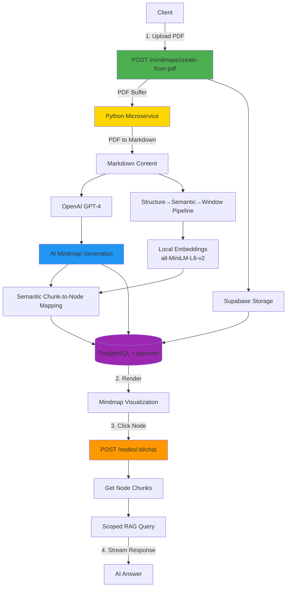

# Mindmap Backend - RAG System with AI Mindmap Generation

Production-ready backend for intelligent document analysis. Upload PDFs to automatically generate interactive mindmaps with AI-powered topic extraction and scoped Q&A capabilities.

## Overview



## Features

**AI-Powered Document Analysis**
- Automatic topic extraction and hierarchical organization
- Keyword identification for each concept
- Intelligent relationship mapping

**Scoped RAG System**
- Click any mindmap node → chat with that topic only
- Higher precision answers through context scoping
- Semantic chunk-to-node linking

**Production Ready**
- Supabase Storage for file persistence
- PostgreSQL + pgvector for vector search
- Row Level Security (RLS) and rate limiting
- TypeScript strict mode

## Quick Start

### Prerequisites

- Node.js 20+
- Supabase project with database and storage
- OpenAI API key

### Installation

```bash
npm install
cp .env.example .env
# Edit .env with your credentials
```

### Environment Variables

```env
# Server
PORT=4000
NODE_ENV=production

# Supabase
SUPABASE_URL=https://your-project.supabase.co
SUPABASE_ANON_KEY=your-anon-key
SUPABASE_SERVICE_ROLE_KEY=your-service-key

# OpenAI
OPENAI_API_KEY=sk-your-key
OPENAI_MODEL=gpt-4-turbo-preview
OPENAI_EMBEDDING_MODEL=text-embedding-3-small

# RAG Configuration
CHUNK_SIZE=1000
CHUNK_OVERLAP=200
TOP_K_CHUNKS=5
```

### Database Setup

Run migrations in Supabase SQL Editor (in order):
```bash
src/db/migrations/0001_init.sql
src/db/migrations/0002_rls.sql
src/db/migrations/0003_ai.sql
```

Create storage bucket in Supabase Dashboard:
- Go to Storage → Create bucket
- Name: `documents`
- Public: false

### Run

```bash
# Development
npm run dev

# Production
npm run build
npm start

# Docker (see DOCKER_RUN_GUIDE.md)
docker compose up --build
```

## API Endpoints

### Authentication

| Method | Endpoint             | Description       |
| ------ | -------------------- | ----------------- |
| POST   | `/api/auth/register` | Register new user |
| POST   | `/api/auth/login`    | Login user        |
| GET    | `/api/auth/me`       | Get current user  |

### Mindmaps (Core Feature)

| Method | Endpoint                               | Description                                |
| ------ | -------------------------------------- | ------------------------------------------ |
| POST   | `/api/mindmaps/create-from-pdf`        | **Upload PDF → Generate mindmap + chunks** |
| POST   | `/api/mindmaps/:id/nodes/:nodeId/chat` | **Chat with specific node (scoped RAG)**   |
| GET    | `/api/mindmaps`                        | List user mindmaps                         |
| GET    | `/api/mindmaps/:id`                    | Get mindmap with full structure            |
| PUT    | `/api/mindmaps/:id`                    | Update mindmap                             |
| DELETE | `/api/mindmaps/:id`                    | Delete mindmap                             |

### RAG & Conversations

| Method | Endpoint                 | Description                       |
| ------ | ------------------------ | --------------------------------- |
| POST   | `/api/chat`              | Chat with streaming (all context) |
| POST   | `/api/query`             | Query without streaming           |
| GET    | `/api/conversations`     | List conversations                |
| GET    | `/api/conversations/:id` | Get conversation with messages    |

## Core Workflow

### 1. Upload PDF & Create Mindmap

**Request:**
```http
POST /api/mindmaps/create-from-pdf
Authorization: Bearer {token}
Content-Type: multipart/form-data

file: document.pdf
title: "Optional custom title"
```

**Response:**
```json
{
  "success": true,
  "data": {
    "id": "uuid",
    "title": "Building Efficient SLM",
    "mindmap_data": {
      "title": "Building Efficient SLM",
      "central_topic": "Efficient Language Models",
      "nodes": [
        {
          "id": "node-0",
          "label": "Efficient SLM Development",
          "keywords": ["efficiency", "optimization"],
          "level": 0,
          "parent_id": null
        }
      ],
      "edges": [
        {
          "from": "node-0",
          "to": "node-1",
          "relationship": "contains"
        }
      ]
    },
    "chunks_created": 45,
    "nodes_count": 8
  }
}
```

### 2. Chat with Node (Scoped RAG)

**Request:**
```http
POST /api/mindmaps/{mindmapId}/nodes/node-1/chat
Authorization: Bearer {token}
Content-Type: application/json

{
  "question": "What are the key components?",
  "stream": true
}
```

**Response (SSE):**
```
data: {"content": "Based on the section"}
data: {"content": ", the key components include..."}
data: [DONE]
```

## Mindmap JSON Structure

```typescript
interface MindmapData {
  title: string;
  central_topic: string;
  summary?: string;
  nodes: MindmapNode[];
  edges: MindmapEdge[];
}

interface MindmapNode {
  id: string;        // "node-0", "node-1", etc.
  label: string;     // Topic name
  keywords: string[]; // 3-7 relevant keywords
  level: number;     // 0 = center, 1+ = branches
  parent_id: string | null;
}

interface MindmapEdge {
  from: string;      // Source node ID
  to: string;        // Target node ID
  relationship?: string; // "contains", "describes", etc.
}
```

## Architecture

### Tech Stack

- **Runtime**: Node.js 20+ with TypeScript
- **Framework**: Express.js 5
- **Database**: Supabase (PostgreSQL + pgvector)
- **AI**: OpenAI GPT-4 for chat, all-MiniLM-L6-v2 for embeddings
- **PDF Processing**: Python microservice (pdf2md)
- **Storage**: Supabase Storage
- **Security**: Helmet, CORS, RLS, Rate Limiting

### Project Structure

```
backend/
├── src/
│   ├── config/           # Environment & API configs
│   ├── db/migrations/    # SQL migrations
│   ├── middlewares/      # Auth, validation, rate limiting
│   ├── modules/
│   │   ├── auth/         # Authentication
│   │   ├── mindmaps/     # Mindmap CRUD & unified workflow
│   │   ├── rag/          # RAG chat endpoints
│   │   └── conversations/# Chat history
│   ├── services/         # LLM, Storage, Embedding, Python client
│   ├── utils/            # Helpers (chunking, similarity)
│   └── server.ts         # Entry point
├── python-service/       # PDF to Markdown microservice
└── tests/                # API tests
```

### How It Works

**Semantic Chunk-to-Node Mapping:**
1. Generate node embeddings from label + keywords
2. Compare with chunk embeddings via cosine similarity
3. Link each chunk to top 2 matching nodes (threshold: 0.55)
4. Unmatched chunks fallback to root node

**Vector Search:**
- Uses pgvector with HNSW index
- Index type: `vector_cosine_ops`
- Parameters: `m=16, ef_construction=64`
- Search time: ~5ms for 10k+ chunks

## Deployment

### Build

```bash
npm run build
```

### Environment

Set `NODE_ENV=production` and configure CORS:
```env
CORS_ORIGIN=https://your-frontend.com
```

### Monitoring

- **Logs**: Pino structured JSON logging
- **Health**: `GET /health` endpoint
- **Errors**: Centralized error handler

## License

MIT

## Support

For issues or questions, create an issue in the repository.
