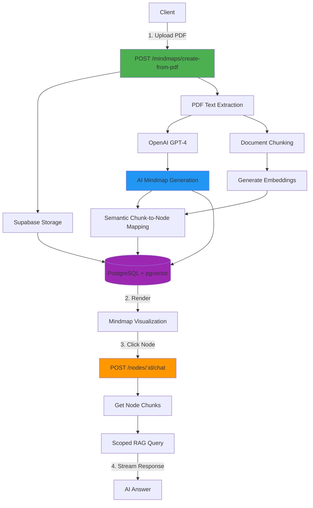

# Mindmap Backend - RAG System with AI Mindmap Generation

Production-ready backend for an intelligent document analysis system. Upload PDFs to automatically generate interactive mindmaps with AI-powered topic extraction and scoped Q&A capabilities.

## Overview



## Features

**AI-Powered Document Analysis**

- Automatic topic extraction and hierarchical organization
- Keyword identification for each concept
- Intelligent relationship mapping

**Scoped RAG System**

- Click any mindmap node → chat with that topic only
- Higher precision answers through context scoping
- Semantic chunk-to-node linking

**Production Ready**

- Supabase Storage for file persistence
- PostgreSQL + pgvector for vector search
- Row Level Security (RLS)
- Rate limiting and authentication
- TypeScript strict mode

---

## Quick Start

### Prerequisites

- Node.js 20+
- Supabase project
- OpenAI API key

### Installation

```bash
npm install
cp .env.example .env
# Edit .env with your credentials
```

### Environment Variables

```env
# Server
PORT=4000
NODE_ENV=production

# Supabase
SUPABASE_URL=https://your-project.supabase.co
SUPABASE_ANON_KEY=your-anon-key
SUPABASE_SERVICE_ROLE_KEY=your-service-key

# OpenAI
OPENAI_API_KEY=sk-your-key
OPENAI_MODEL=gpt-4-turbo-preview
OPENAI_EMBEDDING_MODEL=text-embedding-3-small

# RAG Configuration
CHUNK_SIZE=1000
CHUNK_OVERLAP=200
TOP_K_CHUNKS=5
```

### Database Setup

1. Run migrations in Supabase SQL Editor:

```bash
src/db/migrations/0001_init.sql
src/db/migrations/0002_rls.sql
src/db/migrations/0003_ai.sql
```

2. Create storage bucket in Supabase Dashboard:
   - Go to Storage → Create bucket
   - Name: `documents`
   - Public: false

### Run

```bash
# Development
npm run dev

# Production
npm run build
npm start
```

---

## API Endpoints

### Authentication

| Method | Endpoint             | Description       |
| ------ | -------------------- | ----------------- |
| POST   | `/api/auth/register` | Register new user |
| POST   | `/api/auth/login`    | Login user        |
| GET    | `/api/auth/me`       | Get current user  |

### Mindmaps (Core Feature)

| Method | Endpoint                               | Description                                |
| ------ | -------------------------------------- | ------------------------------------------ |
| POST   | `/api/mindmaps/create-from-pdf`        | **Upload PDF → Generate mindmap + chunks** |
| POST   | `/api/mindmaps/:id/nodes/:nodeId/chat` | **Chat with specific node (scoped RAG)**   |
| GET    | `/api/mindmaps`                        | List user mindmaps                         |
| GET    | `/api/mindmaps/:id`                    | Get mindmap with full structure            |
| PUT    | `/api/mindmaps/:id`                    | Update mindmap                             |
| DELETE | `/api/mindmaps/:id`                    | Delete mindmap                             |

### RAG & Conversations

| Method | Endpoint                 | Description                       |
| ------ | ------------------------ | --------------------------------- |
| POST   | `/api/chat`              | Chat with streaming (all context) |
| POST   | `/api/query`             | Query without streaming           |
| GET    | `/api/conversations`     | List conversations                |
| GET    | `/api/conversations/:id` | Get conversation with messages    |

---

## Core Workflow

### 1. Upload PDF & Create Mindmap

**Request:**

```http
POST /api/mindmaps/create-from-pdf
Authorization: Bearer {token}
Content-Type: multipart/form-data

file: document.pdf
title: "Optional custom title"
```

**Response:**

```json
{
  "success": true,
  "data": {
    "id": "uuid",
    "title": "Building Efficient SLM",
    "file_id": "uuid",
    "storage_url": "https://...signed-url",
    "mindmap_data": {
      "title": "Building Efficient SLM",
      "central_topic": "Efficient Language Models",
      "summary": "Overview of efficient SLM development...",
      "nodes": [
        {
          "id": "node-0",
          "label": "Efficient SLM Development",
          "keywords": ["efficiency", "optimization", "performance"],
          "level": 0,
          "parent_id": null
        },
        {
          "id": "node-1",
          "label": "Model Architecture",
          "keywords": ["transformer", "attention", "layers"],
          "level": 1,
          "parent_id": "node-0"
        },
        {
          "id": "node-2",
          "label": "Training Techniques",
          "keywords": ["distillation", "pruning", "quantization"],
          "level": 1,
          "parent_id": "node-0"
        }
      ],
      "edges": [
        {
          "from": "node-0",
          "to": "node-1",
          "relationship": "contains"
        },
        {
          "from": "node-0",
          "to": "node-2",
          "relationship": "describes"
        }
      ]
    },
    "chunks_created": 45,
    "nodes_count": 8,
    "created_at": "2025-11-23T00:00:00Z"
  }
}
```

### 2. Chat with Node (Scoped RAG)

**Request:**

```http
POST /api/mindmaps/{mindmapId}/nodes/node-1/chat
Authorization: Bearer {token}
Content-Type: application/json

{
  "question": "What are the key components of the model architecture?",
  "stream": true
}
```

**Response (SSE):**

```
data: {"content": "Based on the Model Architecture section"}
data: {"content": ", the key components include..."}
data: [DONE]
```

---

## Mindmap JSON Structure

Frontend receives this structure to render the visualization:

```typescript
interface MindmapData {
  title: string;
  central_topic: string;
  summary?: string;
  nodes: MindmapNode[];
  edges: MindmapEdge[];
}

interface MindmapNode {
  id: string; // "node-0", "node-1", etc.
  label: string; // Topic name
  keywords: string[]; // 3-7 relevant keywords
  level: number; // 0 = center, 1+ = branches
  parent_id: string | null; // Reference to parent
}

interface MindmapEdge {
  from: string; // Source node ID
  to: string; // Target node ID
  relationship?: string; // "contains", "describes", etc.
}
```

**Example Frontend Integration:**

```typescript
// 1. Upload PDF
const formData = new FormData();
formData.append("file", pdfFile);

const { data } = await fetch("/api/mindmaps/create-from-pdf", {
  method: "POST",
  headers: { Authorization: `Bearer ${token}` },
  body: formData,
}).then((r) => r.json());

// 2. Render mindmap
<MindmapVisualization
  nodes={data.mindmap_data.nodes}
  edges={data.mindmap_data.edges}
  onNodeClick={(nodeId) => setSelectedNode(nodeId)}
/>;

// 3. Chat with selected node
const response = await fetch(
  `/api/mindmaps/${data.id}/nodes/${selectedNode}/chat`,
  {
    method: "POST",
    headers: {
      Authorization: `Bearer ${token}`,
      "Content-Type": "application/json",
    },
    body: JSON.stringify({ question, stream: true }),
  }
);

// 4. Handle SSE stream
const reader = response.body.getReader();
// ... process stream
```

---

## Architecture

### Tech Stack

- **Runtime**: Node.js 20+
- **Framework**: Express.js 5
- **Language**: TypeScript (strict)
- **Database**: Supabase (PostgreSQL + pgvector)
- **Vector Search**: pgvector with HNSW index
- **AI**: OpenAI GPT-4 + text-embedding-3-small
- **Storage**: Supabase Storage
- **Security**: Helmet, CORS, RLS, Rate Limiting

### Project Structure

```
backend/
├── src/
│   ├── config/           # Environment & API configs
│   ├── db/
│   │   └── migrations/   # SQL migration files
│   ├── middlewares/      # Auth, validation, rate limiting
│   ├── modules/
│   │   ├── auth/         # Authentication
│   │   ├── conversations/# Chat history
│   │   ├── mindmaps/     # Mindmap CRUD & unified workflow
│   │   └── rag/          # RAG chat endpoints
│   ├── services/         # LLM, Storage, Embedding services
│   ├── utils/            # Helpers, chunking, logging
│   ├── app.ts            # Express setup
│   └── server.ts         # Entry point
└── tests/                # API test files
```

---

## How It Works

### Semantic Chunk-to-Node Mapping

1. **Generate Node Embeddings**: Combine node label + keywords
2. **Compare with Chunks**: Calculate cosine similarity
3. **Link Chunks**: Assign each chunk to top 2 matching nodes (threshold: 0.55)
4. **Fallback**: Unmatched chunks → root node

**Example:**

```
Node: "Model Architecture" + ["transformer", "attention"]
Chunk: "The transformer uses multi-head attention..."
Similarity: 0.78 ✓ → Linked!
```

### Vector Search

Uses **pgvector** with **HNSW** index for fast similarity search:

- Index type: `vector_cosine_ops`
- Parameters: `m=16, ef_construction=64`
- Search time: ~5ms for 10k+ chunks

---

## Production Deployment

### Build

```bash
npm run build
```

### Environment

Set `NODE_ENV=production` and configure CORS:

```typescript
// In production, set allowed origins
CORS_ORIGIN=https://your-frontend.com
```

### Monitoring

- Logs: Uses Pino for structured JSON logging
- Errors: Centralized error handler with stack traces
- Health: `GET /health` endpoint

---

## Rate Limits

| Operation      | Limit            |
| -------------- | ---------------- |
| General API    | 100 req / 15 min |
| Authentication | 5 req / 15 min   |
| PDF Upload     | 10 req / hour    |
| Chat/Query     | 60 req / hour    |

---

## License

MIT

---

## Support

For issues or questions, create an issue in the repository.
